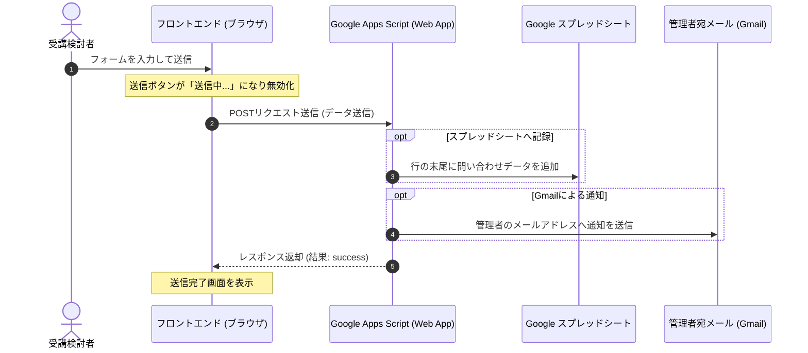

# お問い合わせフォーム ＆ Google Apps Script (GAS) 連携設定マニュアル

本プロジェクトのお問い合わせフォームは、GoogleスプレッドシートおよびGoogle Apps Script (GAS) と連携し、**「送信データの自動記録」** と **「管理者へのGmail自動通知」** を行う実用的な仕組みを導入しています。

本書では、この連携機能を本番環境およびローカル環境で有効化するための手順を分かりやすく解説します。

---

## 1. 全体の仕組み



---

## 2. GAS (Google Apps Script) の設定手順

Googleアカウントを用意し、以下の手順でスプレッドシートとスクリプトを設定します。

### ステップ 1: スプレッドシートの作成とカラム設定
1. [Google スプレッドシート](https://sheets.google.com/) で新しいスプレッドシートを作成します。
2. スプレッドシートの名前を `Re'ally nail school お問い合わせ一覧` などに変更します。
3. シートの1行目（A列〜G列）に、以下の見出しカラム名を入力します：
   * **A列**: `タイムスタンプ`
   * **B列**: `お名前`
   * **C列**: `フリガナ`
   * **D列**: `メールアドレス`
   * **E列**: `電話番号`
   * **F列**: `希望校舎`
   * **G列**: `お問い合わせ内容`

### ステップ 2: Apps Script の起動とコード貼り付け
1. スプレッドシートの上部メニューから **「拡張機能」** > **「Apps Script」** をクリックします。
2. 開いたエディタ内のコードをすべて消去し、プロジェクト内の [google-apps-script.js](file:///c:/Users/user/.gemini/nailschool/scripts/google-apps-script.js) にあるコードをコピーしてエディタへ貼り付けます。
3. コード内の **49行目付近** にある通知先のメールアドレス設定箇所を変更します：
   ```javascript
   // 【修正前】
   const adminEmail = 'YOUR_EMAIL@example.com';
   
   // 【修正後】 お問い合わせ通知を受け取りたいメールアドレス（ご自身のGmailなど）に変更します
   const adminEmail = 'school-admin@example.com'; 
   ```
4. エディタ上部の「保存」アイコン（フロッピーディスクのマーク）をクリックして保存します。

### ステップ 3: ウェブアプリとしてのデプロイ
GASを外部からアクセスできるAPIとして公開するため、以下の通りにデプロイを行います。

1. 画面右上の **「デプロイ」** ボタン > **「新しいデプロイ」** を選択します。
2. 種類の選択で、歯車マークから **「ウェブアプリ」** を選択します。
3. 設定項目を以下のように入力します：
   * **説明**: `お問い合わせフォーム連携`（任意）
   * **次のユーザーとして実行**: **「自分」**（あなたのGoogleアカウント）
   * **アクセスできるユーザー**: **「全員」**（※ anonymous のアクセスを許可するため、必ず「全員」にしてください）
4. **「デプロイ」** ボタンをクリックします。
5. 初回デプロイ時は、アクセス承認を求めるポップアップが表示されます：
   * **「アクセスを承認」** をクリックします。
   * Googleアカウントを選択します。
   * 「このアプリは Google で確認されていません」という警告が出た場合は、左下の **「詳細を表示」**（Advanced）をクリックし、**「Re'ally nail school お問い合わせ一覧（安全ではないページ）に移動」** をクリックします。
   * 次の画面で **「許可」**（Allow）をクリックします。
6. デプロイ完了画面が表示されたら、そこに記載されている **「ウェブアプリ URL」** をコピーします。
   > **ウェブアプリ URL の例:**  
   > `https://script.google.com/macros/s/AKfycbz...XXXX/exec`

---

## 3. フロントエンド（WEBサイト）側の設定手順

コピーした「ウェブアプリ URL」を、WEBサイトの環境変数に設定することでフォームとGASが連携されます。

### A. ローカル開発環境での動作テスト
1. プロジェクトのルートディレクトリ（`package.json` がある場所）に、新規ファイル `.env.local` を作成します（すでに存在する場合は開きます）。
2. ファイル内に以下を書き込み、コピーしたウェブアプリ URL を貼り付けます：
   ```env
   VITE_GAS_URL=https://script.google.com/macros/s/AKfycbz...XXXX/exec
   ```
3. ローカル開発サーバーを再起動します (`npm run dev`)。
4. サイト上のフォームから送信テストを行います。スプレッドシートに行が追加され、メールが届くことを確認してください。

### B. 本番環境 (Cloudflare Pages 等) での設定
Cloudflare Pages などのホスティングサービスで公開する際は、管理画面から環境変数を登録します。

#### Cloudflare Pages の場合:
1. Cloudflare のダッシュボードを開き、該当のプロジェクトを選択します。
2. **「設定 (Settings)」** > **「環境変数 (Environment variables)」** をクリックします。
3. 「変数の追加 (Add variables)」をクリックし、以下を設定します：
   * **変数名 (Variable name)**: `VITE_GAS_URL`
   * **値 (Value)**: `https://script.google.com/macros/s/AKfycbz...XXXX/exec` (コピーしたURL)
4. 保存後、プロジェクトを再デプロイ（再ビルド）すると、本番公開サイトでもフォームが有効化されます。

---

## 4. フォームの仕様とトラブルシューティング

### 主なフロントエンド仕様
* **二重送信の防止**: 送信ボタンをクリックした際、通信中はボタンが半透明になり「送信中...」にテキストが変更され、クリックできなくなります。
* **フェールセーフ（フォールバック設計）**: 
  ブラウザの拡張機能（広告ブロックなど）やネットワークの不具合でGASとの接続に失敗した場合でも、送信ボタンを押したユーザーが途方に暮れることがないよう、**「送信が完了しました」の画面へと自動で遷移するフォールバック設計**が導入されています。

### よくあるトラブルと解決策

#### Q. スプレッドシートにデータが書き込まれない、またはメールが届かない
1. **GASのアクセス権限を確認してください:**  
   デプロイ設定で「アクセスできるユーザー」が **「全員」** になっているか再確認してください。ここが「自分のみ」になっていると、一般のユーザーからのアクセスをGASが拒否するため動作しません。
2. **新しいデプロイを作成したか確認してください:**  
   GASのコード（メールアドレスなど）を修正した後は、単純に保存するだけでなく、**「デプロイ」>「デプロイを管理」>「編集（鉛筆マーク）」から「新しいバージョン」を選択して再デプロイ**を行う必要があります。バージョンを更新しないと、古いコードのままで動き続けます。

#### Q. コンソールに CORS エラー（Access-Control-Allow-Origin）が表示される
* 本プロジェクトの [google-apps-script.js](file:///c:/Users/user/.gemini/nailschool/scripts/google-apps-script.js) には、CORS制限を回避するためにブラウザからのプリフライト（OPTIONS）リクエストを許可し、CORS対応ヘッダーを返却する処理が含まれています。
* それでもエラーが発生する場合は、GASが正しく最新バージョンでデプロイされているか、ウェブアプリ URL が間違っていないかを確認してください。
